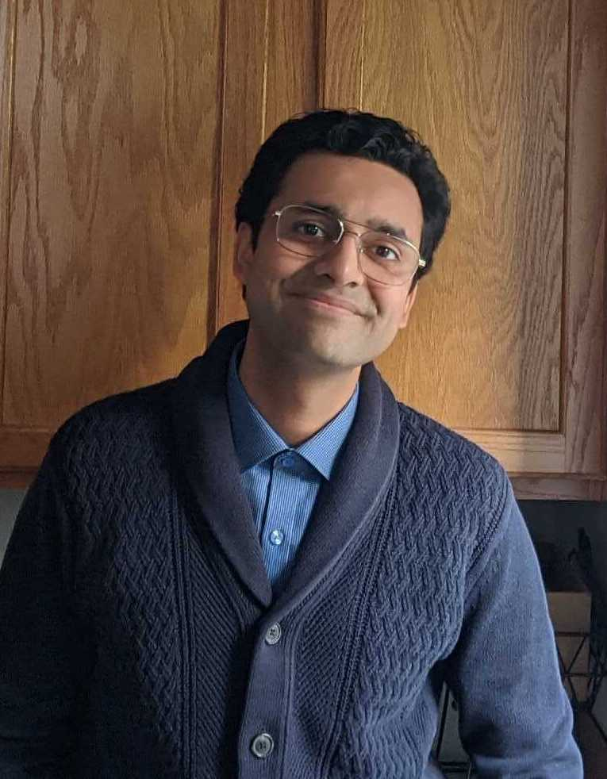

<link rel="preconnect" href="https://fonts.googleapis.com">
<link rel="preconnect" href="https://fonts.gstatic.com" crossorigin>
<link href="https://fonts.googleapis.com/css2?family=Open+Sans&display=swap" rel="stylesheet"> 
<link href="https://fonts.googleapis.com/css2?family=Lato:wght@300&display=swap" rel="stylesheet"> 
<link href="https://fonts.googleapis.com/css2?family=Nanum+Myeongjo&display=swap" rel="stylesheet"> 
<link rel="stylesheet" href="styles.css" type="text/css">
<link rel="stylesheet" href="https://cdn.jsdelivr.net/gh/jpswalsh/academicons@1/css/academicons.min.css">

<strong style="color:#964B00;font-size:24pt;">Prateekshit "Kanu" Pandey </strong>

I am a PhD Candidate at the Annenberg School for Communication at the University of Pennsylvania, where I am a member of [Prof. Emily Falk](https://www.asc.upenn.edu/people/faculty/emily-falk-phd)'s [Communication Neuroscience Lab](https://www.asc.upenn.edu/research/centers/communication-neuroscience-lab). I am currently studying the neuropsychology of political humor, and the ways in which engagement with humor interacts with political efficacy to increase political participation. I earned a Bachelors in Technology at IIIT-Delhi, in Computer Science and Engineering, where I was a member of the [Image Analysis and Biometrics Lab](http://iab-rubric.org/) with [Dr. Mayank Vatsa](http://home.iitj.ac.in/~mvatsa/) and [Dr. Richa Singh](http://home.iitj.ac.in/~richa/) (both current at IIT Jodhpur).

I am currently ABD (All But Dissertation), and my dissertation title is "<i>Disentangling the reciprocal causal relationship between political efficacy and news sharing behavior</i>." In my dissertation, I am studying the reciprocal effects of political efficacy, or one's believe in their abilities to participate in politics, and their news sharing behavior, for both traditional and comedic news formats. The committe for this dissertation consists of Prof. Emily Falk (chair), [Prof. Joseph N Cappella](https://www.asc.upenn.edu/people/faculty/joseph-n-cappella-phd), [Prof. Michael X Delli-Carpini](https://www.asc.upenn.edu/people/faculty/michael-x-delli-carpini-phd), and [Prof. Danna Young](https://sites.google.com/view/dgoldyoung/home).

When I am not seen standing in front of wooden cabinets or putting human brains in large magnets, I can be found performing improvisational comedy at [Comedy Sportz Philadelphia](https://www.comedysportzphilly.com/). 
