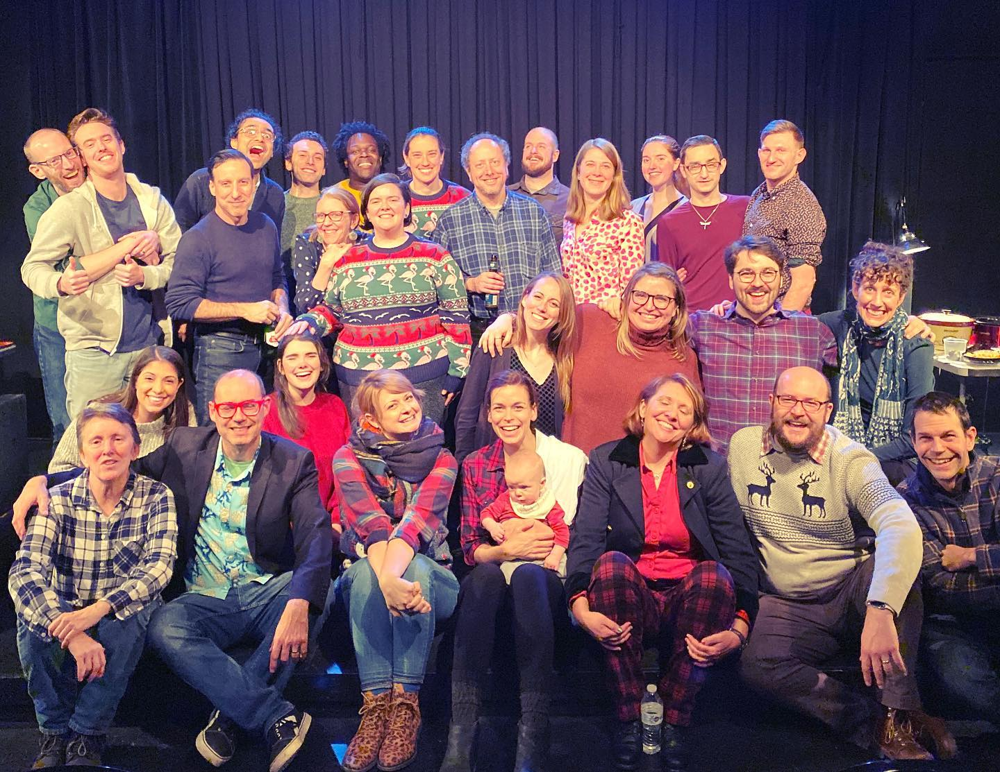
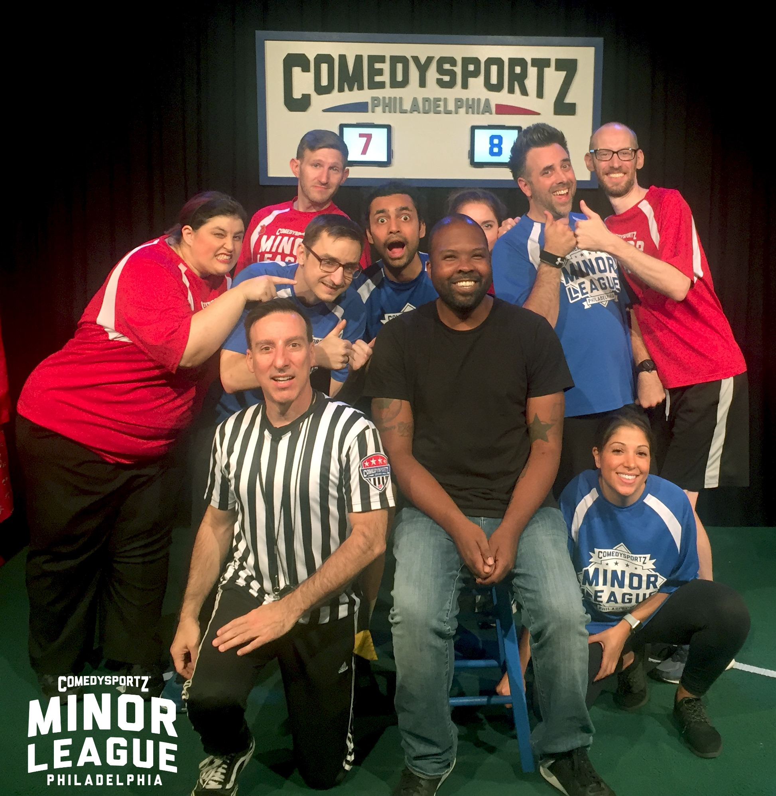
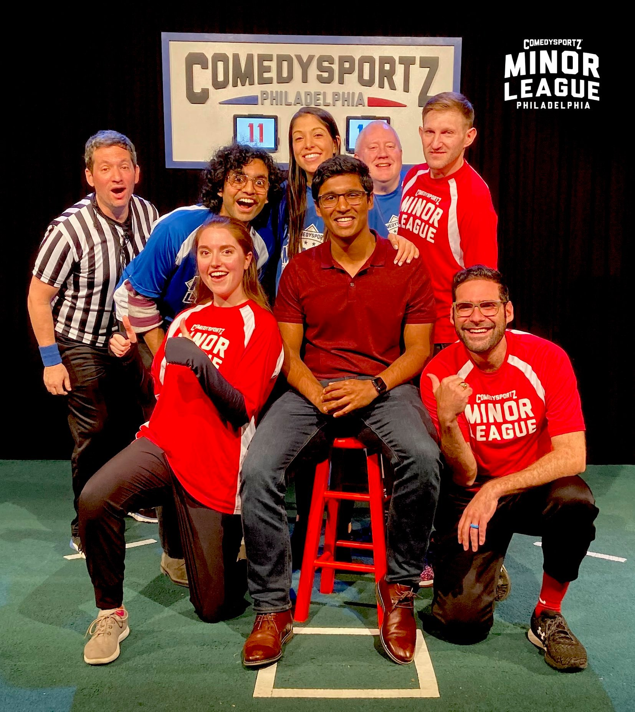
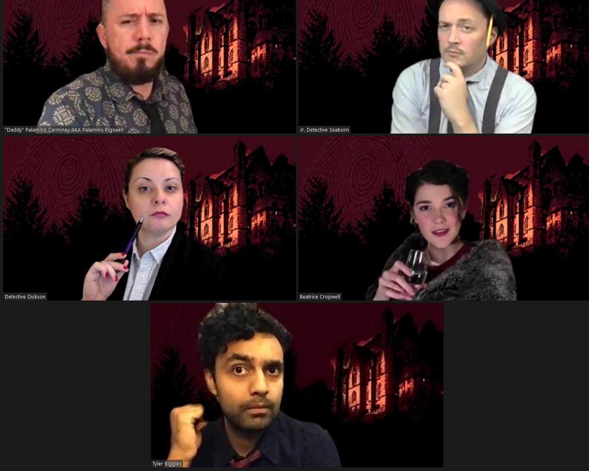
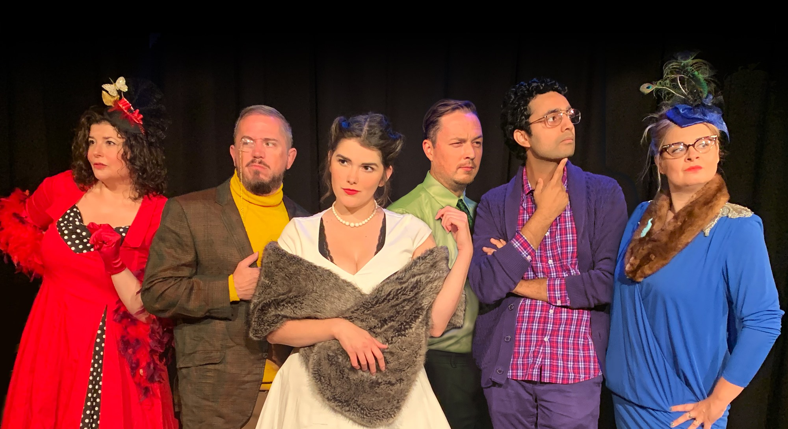
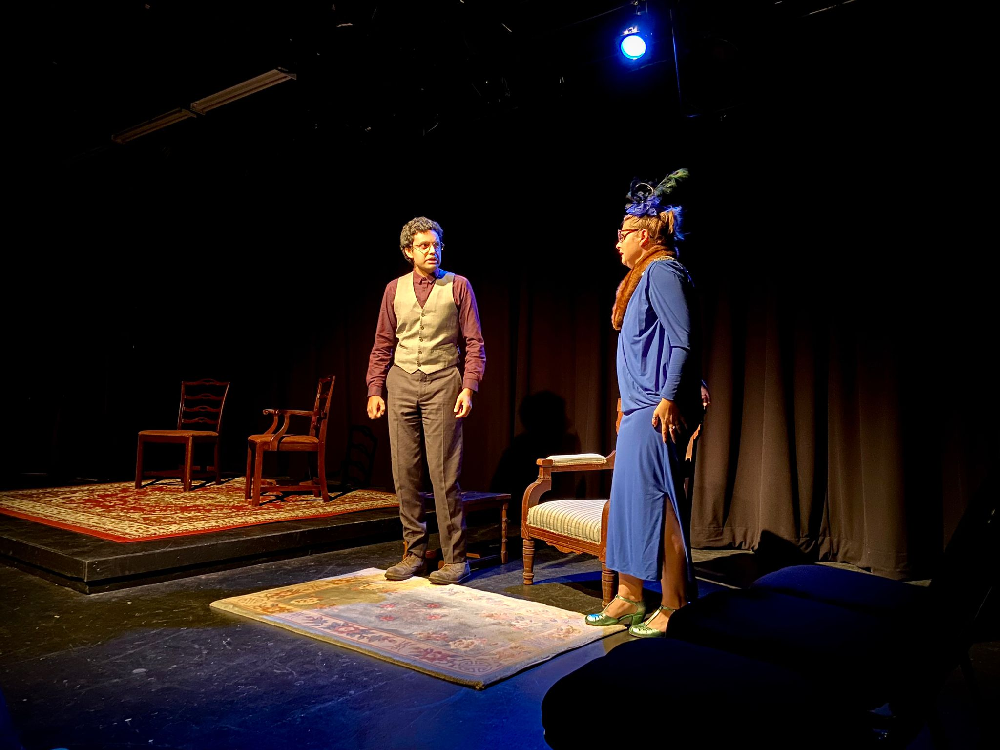

<link rel="preconnect" href="https://fonts.googleapis.com">
<link rel="preconnect" href="https://fonts.gstatic.com" crossorigin>
<link href="https://fonts.googleapis.com/css2?family=Open+Sans&display=swap" rel="stylesheet"> 
<link href="https://fonts.googleapis.com/css2?family=Lato:wght@300&display=swap" rel="stylesheet"> 
<link href="https://fonts.googleapis.com/css2?family=Nanum+Myeongjo&display=swap" rel="stylesheet"> 

<link rel="stylesheet" href="styles.css" type="text/css">
<link rel="stylesheet" href="https://cdn.jsdelivr.net/gh/jpswalsh/academicons@1/css/academicons.min.css">

  
I am a main stage performer at the Comedy Sportz Philadelphia theater, where I perform short and long form improvisational comedy. Since 2019, I have performed in several productions, including Minor League (Sunday matinee shows), Murder Manor (long form improvised murder mystery), and Match Game.

<h3> Minor League </h3>

 

<h3> Murder Manor </h3>

